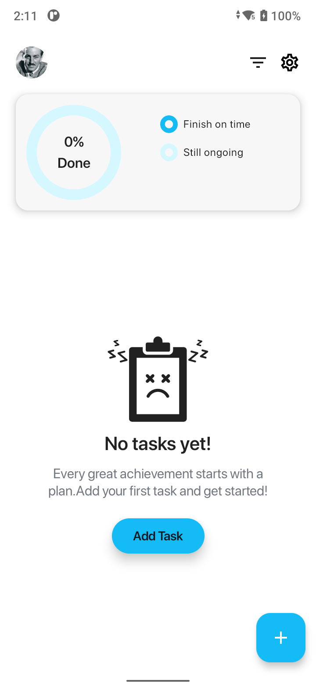
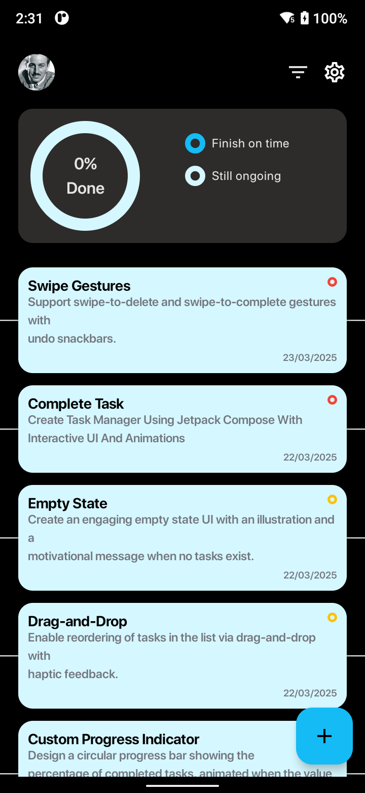

# Task Manager App 🚀

A modern task management app built with **Jetpack Compose**, **Room Database**, and **Material Design 3**.

---

## Features ✨

- **Task Creation**: Add tasks with a title, description, priority, and due date.
- **Task List**: Display tasks in a dynamic, filterable list.
- **Task Details**: View detailed information about a task **&** Mark tasks as completed or delete them.
- **Persistent Storage**: Save tasks locally using the Room Database.
- **Theme Switching**: Supports light and dark modes with dynamic color theming.
- **Sort & Filter**: Sort tasks by priority, due date, or alphabetically **&** Filter tasks by status: All, Completed, or Pending.

---

## Screenshots 📸

| Light Theme | Dark Theme |
|-------------|------------|
|  |  |

---

## Demo Video 🎥

### YouTube Embed
<iframe width="560" height="315" src="https://youtube.com/shorts/nYtevY8uoS4?feature=share" frameborder="0" allowfullscreen></iframe>

### Local Video File
[Watch the demo video](screenshots/light_dark.mp4)

---

## Setup Instructions 🛠️

1. Clone the repository:
   ```bash
   git clone https://github.com/PiyushMangukiya03/TaskManager.git
   cd TaskManager
